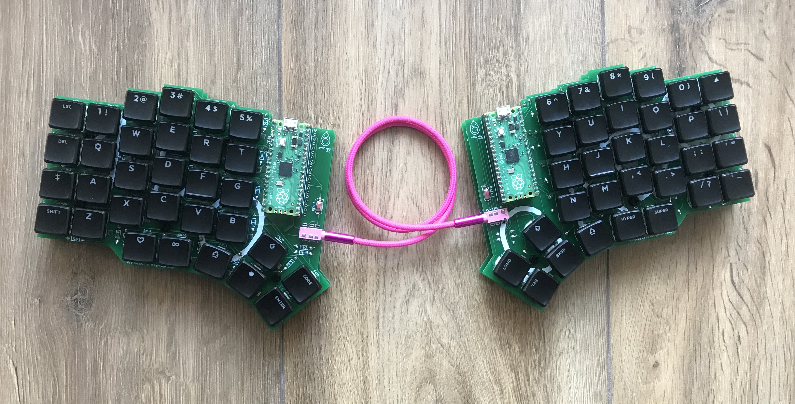
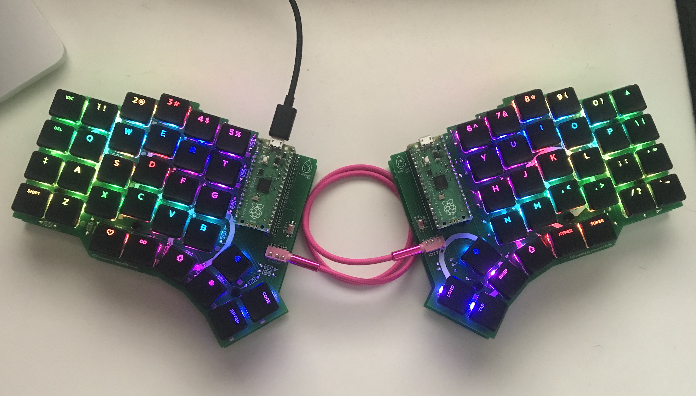
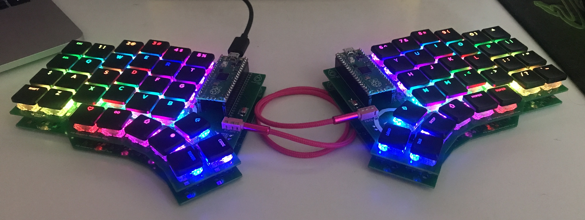

# Avocado

**Split, low profile keyboard with per-key RGB backlit.**

**Features:**
- 62 hot swappable, low profile mechanical switches. Compatible with:
  - **Kailh Chocolate (Choc) V1 Low Profile (PG1350)**
  - **Kailh Chocolate (Choc) V2 Low Profile (PG1353)**
- 62 RGB lights under switches
- 128x32 OLED screen (no code for it yet)



## Compiling the keyboard layout

You can use the `avovado_default.hex` file provided in this repository to flash your keyboard with a default layout.

If you want to make changes:

1. Clone [this](https://github.com/maksrojek/qmk_firmware) repository
2. Checkout to the `avocado` branch
```bash
git checkout avocado
```
3. Pull submodules

If it's the first time you check-out the repo:
```bash
git submodule update --init --recursive
```
if not then:
```bash
git submodule update --recursive
```
4. Do desired changes to the files
5. Compile Avocado's keymap using docker
```bash
util/docker_build.sh avocado:default
```

After that you're going to get the `avocado_default.hex` file under the root of the repository you've just cloned. Use it to flash both sides of the keyboard. 

> **WARNING!**
>
> Do not plug in to the usb both sides of the keyboard at the same time!
## Flashing

Use [QMK Toolbox](https://github.com/qmk/qmk_toolbox) for easy flashing.
If you have any problem refer to the [QMK docs](https://docs.qmk.fm/#/newbs_flashing).

## More images



